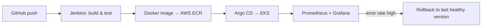

---

## 👩‍💻 Who I Am

I'm a **Software Engineer at CGI (Chennai)** who has spent **3+ years in production support** for business-critical telecom ordering and billing applications: monitoring batch jobs, handling incidents, doing RCA, and keeping SLAs green.

Every time the same failure came back, I asked *"why is a human fixing this?"* That question took me into **automation, CI/CD, Kubernetes and observability**, and it's why I'm now building toward **DevOps / SRE**.

🟢 **Open to:** DevOps · SRE · Cloud Support · Production Engineering roles

---

## 📈 By the Numbers

| 🗓️ | 🎫 | ⚠️ | 🖥️ | 🏆 | 🛠️ |
|:-:|:-:|:-:|:-:|:-:|:-:|
| **3+ yrs** | **~50 / month** | **2-3 / month** | **13 servers** | **Bronze Award** | **4 projects** |
| in production support | tickets & incidents (ServiceNow) | high-priority incidents handled | health checks automated (Ansible + PowerShell) | CGI, for automation | built end to end |

---

## 🔧 What I've Built

### 🚀 Auto-Rollback Guard: bad release in, healthy release back
> **Problem:** a bad deployment reaches production and someone has to notice, decide and roll back by hand.
> **What I built:** a GitOps pipeline that ships versioned images, watches error rates after every release, and rolls back to the last healthy version.

`Jenkins` `Docker` `ECR` `EKS` `Argo CD` `Prometheus` `Grafana` · includes an **incident runbook** (detect → validate → rollback → RCA)  
🔗 [auto-rollback-guard](https://github.com/kaviya914914/auto-rollback-guard)

### 🩹 Crash-Loop Remediator: Kubernetes that heals itself
> **Problem:** pods stuck in `CrashLoopBackOff` need a person to investigate and restart them.
> **What I built:** a Python operator that detects crash-looping pods and remediates them automatically.

`Python` `kopf` `Kubernetes`  
🔗 [crash-loop-remediator](https://github.com/kaviya914914/crash-loop-remediator)

### 📜 JCL Failure Analyzer: from cryptic abend code to first fix
> **Problem:** mainframe batch failures show codes like S0C7 or S806, and triage means looking each one up.
> **What I built:** a Python tool that reads job logs and explains each abend code with its meaning and first checks. Built from real production support patterns and tested on sample logs.

`Python`  
🔗 [jcl-failure-analyzer](https://github.com/kaviya914914/jcl-failure-analyzer)

### 🔐 Cert Expiry Watchdog: no more surprise certificate outages
> **Problem:** expired TLS certificates take services down without warning.
> **What I built:** a Python checker that scans a list of sites and reports OK / warning / critical before anything expires.

`Python`  
🔗 [cert-expiry-watchdog](https://github.com/kaviya914914/cert-expiry-watchdog)

---

## 🧠 What I Bring to a Team

- **I've been on the other side of the alert.** I know what a good runbook, a clear alert and a clean handoff feel like at 3 AM.
- **RCA is a habit, not a step.** I don't stop at "restarted and fixed".
- **I automate the repeat.** Ansible, Python, Bash and PowerShell for the work nobody should do twice.
- **I ship and I verify.** CI/CD is only useful if you can see the result, so I pair every pipeline with monitoring.
- **SLA-minded.** Incidents, changes, releases and war rooms are part of my normal week.

---

## 🧰 Toolbox, by incident lifecycle

**🔍 Detect**

**🚨 Respond**

**⚙️ Automate**

**🚀 Ship**

---

## 💼 Experience

**Software Engineer, CGI** · Sep 2025 – Present  
Production support for business-critical ordering & billing apps · Control-M batch monitoring · ServiceNow incidents (~50/month) · 5-6 BAU deployments a month · RCA, change & release management · war rooms, DR exercises, on-call

**Associate Software Engineer, CGI** · Sep 2023 – Aug 2025  
SLA-driven production support · automated health & sanity checks across 13 Windows servers (Ansible, PowerShell, YAML) · operational dashboards and Jira tracking · 🥉 CGI Bronze Award for automation

---

## 📊 GitHub Activity

---

## 📚 Learning Now

`Terraform & IaC` · `Kubernetes operators` · `Alerting & logging (Alertmanager, Loki/ELK)`

## 🎓 Education & Certifications

MBA, Business Data Analytics: University of Madras (2024 – 2026) · B.Sc. Computer Science: SDNB Vaishnav College for Women (2020 – 2023) · CGI Skillsoft: Docker, AWS, Linux · AWS Cloud Quest: Cloud Practitioner

---

